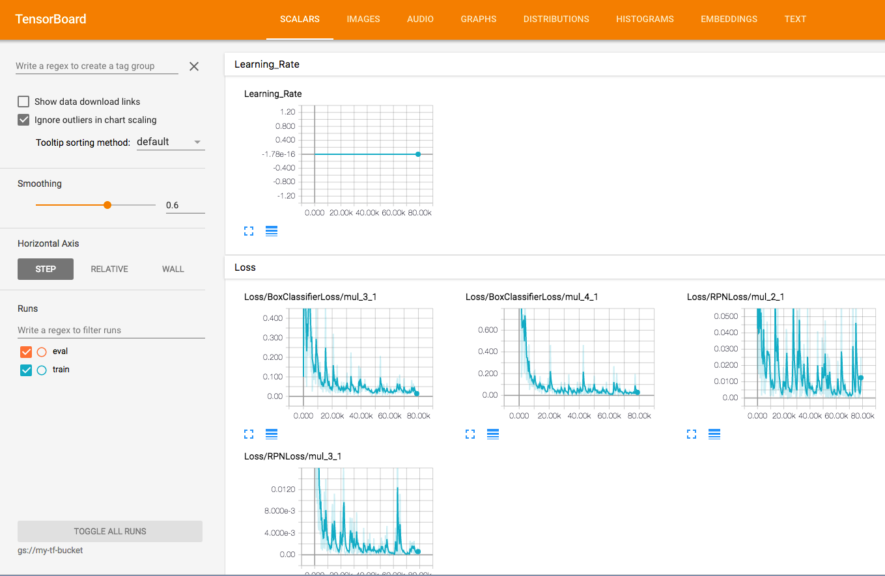
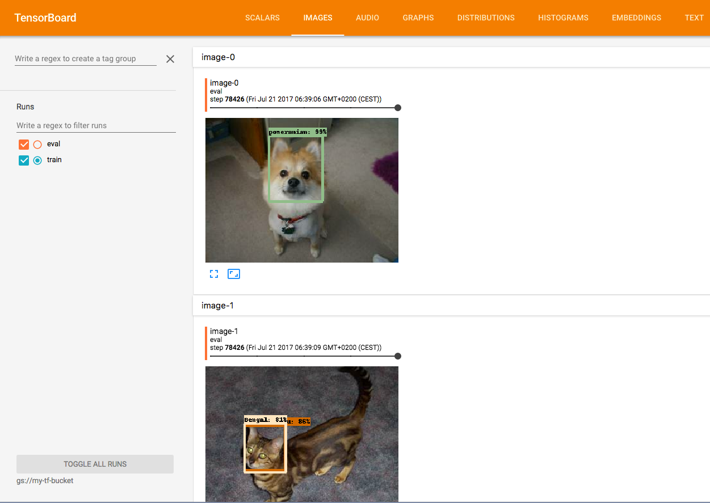
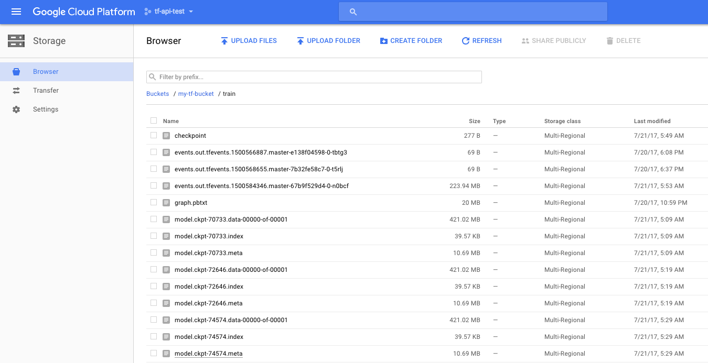

# Intro
For practice and proof of concept, I will go through several tutorials about TensorFlow Object Detection API.

https://github.com/tensorflow/models/tree/master/object_detection
https://github.com/tensorflow/models/blob/master/object_detection/g3doc/installation.md
https://github.com/tensorflow/models/blob/master/object_detection/g3doc/running_pets.md

From a high-level perspective, the example shows

- Test the Object Detection API (just run the test)
- Apply the API to a pet classification dataset (37 classes)
- Train and validate the model on Google Cloud Platform, which consists of
  - Host your data on Google Cloud Storage
  - Call Cloud ML API provided by Google Cloud to train your model
  - Use TensorBoard to monitor the model training
  - Convert model from Cloud ML API to TensorFlow

This example assumes that you have no experience in Google Cloud Platform.

# Task 1: Test the API locally

[Oringial document](https://github.com/tensorflow/models/blob/master/object_detection/g3doc/installation.md)

In case you are also new to Python, you can bear with me and use [Anaconda](https://www.continuum.io/downloads) to save your time on survey and installing Python. 

If you are seasoned Python developer, I believe you know how to convert the following Conda style commands for your environment (e.g. virtual env, Docker, etc).

## Create conda environment
```
# create an environment named as tf-api, and use Python 3.5 (or 3.6 if you prefer)
conda install -n tf-api python=3.5
source activate tf-api
```

## Install Python packages
```
# For CPU (if you need to test gpu, use tensorflow-gpu)
pip install tensorflow
pip install pillow lxml jupyter matplotlib
```

## Compile the Protobuf before use

It converts the *.proto in the directory for Python use.

I have donwloaded the directory into this example repository; you can just clone and cd to its [offical repository](https://github.com/tensorflow/models) 

```
protoc object_detection/protos/*.proto --python_out=.
```

**NOTE**

Without doing this, later you may encounter error like 

```
cannot import name 'anchor_generator_pb2**
```

## Set Python environment

Let you Python detect the modules needed.

```
# so your Python can import libraries from . and ./slim
export PYTHONPATH=$PYTHONPATH:`pwd`:`pwd`/slim
```

## Run the test

```
python object_detection/builders/model_builder_test.py

.......
----------------------------------------------------------------------
Ran 7 tests in 0.058s

OK
```

Now it's time for real example (apply it on images)

# Task 2: Pet classification on Google Cloud

[Original document](https://github.com/tensorflow/models/blob/master/object_detection/g3doc/running_pets.md)

Here I will use Cloud SDK (all command-line)

You need to 

- Register a [Google Cloud Platform account](https://console.cloud.google.com/) 
- Download and install [Cloud SDK](https://cloud.google.com/sdk/downloads)

In this example, I will use ``tf-api-test`` for both project and configuration name.


**Create project**

Currently, Cloud SDK does not provide API to create a project, you need to create it from

[https://cloud.google.com/resource-manager/docs/creating-managing-projects](https://cloud.google.com/resource-manager/docs/creating-managing-projects
)

**Enable ML Engine APIs for the project**

Again, you need to use this [link](https://console.cloud.google.com/flows/enableapi?apiid=ml.googleapis.com,compute_component&_ga=1.73374291.1570145678.1496689256) to allow your project to use ML Engine APIs


## Set Cloud SDK configuration

```
# Just the instruction
gcloud init

# Check the configuration
gcloud config list
```

You may see something like 

```
[core]
account = YOUR-GMAIL
disable_usage_reporting = False
project = tf-api-test
```

## Set up Google Cloud Storage (GCS) bucket

[https://cloud.google.com/storage/docs/creating-buckets](https://cloud.google.com/storage/docs/creating-buckets
)

The data will be uploaded to this cloud storage accessed by the code.

First, I will name the bucket as ``my-tf-bucket``

The simplest way to create a bucket is just like this
```
gsutil mb gs://my-tf-bucket


Creating gs://my-tf-bucket/...
```

Alternatively, you can also to specify three parameters

- p: project name
- c: storage class
- l: location

```
gsutil mb -p tf-api-test -c coldline -l eu gs://my-tf-bucket
``` 

## Get the Pets Dataset and Upload to GCS

```
wget http://www.robots.ox.ac.uk/~vgg/data/pets/data/images.tar.gz
wget http://www.robots.ox.ac.uk/~vgg/data/pets/data/annotations.tar.gz
tar -xvf images.tar.gz
tar -xvf annotations.tar.gz
```

## Convert the dataset for Tensorflow Object Detection API

The data has to be TFRecord, use the provided script to convert them.

```
python object_detection/create_pet_tf_record.py \
    --label_map_path=object_detection/data/pet_label_map.pbtxt \
    --data_dir=`pwd` \
    --output_dir=`pwd`
    
# ignore the warrings :)    
```
You will get your training and validation set ready as

- pet_train.record
- pet_val.record

## Upload the dataset up GCS

```
gsutil cp pet_train.record gs://my-tf-bucket/data/pet_train.record
gsutil cp pet_val.record gs://my-tf-bucket/data/pet_val.record
gsutil cp object_detection/data/pet_label_map.pbtxt gs://my-tf-bucket/data/pet_label_map.pbtxt
```

## Download COCO-pretrained Model for Transfer learning

Transfer learning is a way to give your model a better initialization by loading a pre-trained model (usually from other tasks and domains). By doing this, we can hopefully spend less time training and get better result (because we stand on the shoulder on giant).


This pretrained model is: ``Faster R-CNN with Resnet-101 on COCO dataset``

We will download it and upload to our GCS directory

(Accurately, ``gs://my-tf-bucket/data/``)

```
wget http://storage.googleapis.com/download.tensorflow.org/models/object_detection/faster_rcnn_resnet101_coco_11_06_2017.tar.gz
tar -xvf faster_rcnn_resnet101_coco_11_06_2017.tar.gz
gsutil cp faster_rcnn_resnet101_coco_11_06_2017/model.ckpt.* gs://my-tf-bucket/data/
```

## Configure the Object Detection pipeline

Finally the technical part. We need to set our configuration in a file to let TensorFlow Object Detection API to work. In this example, we use the provided config example: ``faster_rcnn_resnet101_pets.config``

Open the config file and use you editor to replace ``PATH_TO_BE_CONFIGURE`` with ``gs://my-tf-bucket/data/``

Note

In this repository, I have edited. You can get the raw template at 

``object_detection/samples/configs/faster_rcnn_resnet101_pets.config``

Then upload the config to the bucket

```
gsutil cp faster_rcnn_resnet101_pets.config gs://my-tf-bucket/data/faster_rcnn_resnet101_pets.config
```

**Check the data on GCS**

```
gsutil ls gs://my-tf-bucket/data/

# you should see these
gs://my-tf-bucket/data/faster_rcnn_resnet101_pets.config
gs://my-tf-bucket/data/model.ckpt.data-00000-of-00001
gs://my-tf-bucket/data/model.ckpt.index
gs://my-tf-bucket/data/model.ckpt.meta
gs://my-tf-bucket/data/pet_label_map.pbtxt
gs://my-tf-bucket/data/pet_train.record
gs://my-tf-bucket/data/pet_val.record
```

You can also check the file via [browser](https://console.cloud.google.com/storage/browser) 

## Start Training and Evaluation Jobs on Google Cloud ML Engine

In order to start a job on Google Cloud ML Engine, we need 

- Package the code
- Writer cluster configuration

Use the provided script the pack (two files)

```
python setup.py sdist
cd slim && python setup.py sdist
```

You should see these packed files

- dist/object_detection-0.1.tar.gz
- slim/dist/slim-0.1.tar.gz

The provided cluster configuration look like this

```
# cloud.yml
trainingInput:
  runtimeVersion: "1.0"
  scaleTier: CUSTOM
  masterType: standard_gpu
  workerCount: 5
  workerType: standard_gpu
  parameterServerCount: 3
  parameterServerType: standard
```

Which set 5 workers (1 master, 4 slaves), 3 parameter servers, leave the others as stardard.

## Submit the Training job

```
gcloud ml-engine jobs submit training `whoami`_object_detection_`date +%s` \
    --job-dir=gs://my-tf-bucket/train \
    --packages dist/object_detection-0.1.tar.gz,slim/dist/slim-0.1.tar.gz \
    --module-name object_detection.train \
    --region europe-west1 \
    --config cloud.yml \
    -- \
    --train_dir=gs://my-tf-bucket/train \
    --pipeline_config_path=gs://my-tf-bucket/data/faster_rcnn_resnet101_pets.config


```

You may see something like

```
Job [spencer_object_detection_1500567100] submitted successfully.
Your job is still active. You may view the status of your job with the command

  $ gcloud ml-engine jobs describe spencer_object_detection_1500567100

or continue streaming the logs with the command

  $ gcloud ml-engine jobs stream-logs spencer_object_detection_1500567100
jobId: spencer_object_detection_1500567100
```

Note

- The job name is ``MYACCOUNT_object-detection_DATE``, change anything you like.
- I set my region to ``europe-west1``, you can of course change it.
- The weird line between --config and --train_dir is necessary!

Meanwhile the training task is running/queing, we can submit another job for evaluation 

```
gcloud ml-engine jobs submit training `whoami`_object_detection_`date +%s` \
    --job-dir=gs://my-tf-bucket/train \
    --packages dist/object_detection-0.1.tar.gz,slim/dist/slim-0.1.tar.gz \
    --module-name object_detection.eval \
    --region europe-west1 \
    --config cloud.yml \
    --scale-tier CUSTOM \
    -- \
    --checkpoint_dir=gs://my-tf-bucket/train \
    --eval_dir=gs://my-tf-bucket/eval \
    --pipeline_config_path=gs://my-tf-bucket/data/faster_rcnn_resnet101_pets.config
```

Note:

The ``scale-tier`` has to match the config in ``cloud.yml``

The valid choices are [BASIC, BASIC_GPU, CUSTOM, PREMIUM_1, STANDARD_1].

You can monitor the jobs with [ML Engine Dashboard](https://console.cloud.google.com/mlengine/jobs)


## Monitor the tasks from local

Now we connect TensorBoard to the bucket.

```
gcloud auth application-default login
tensorboard --logdir=gs://my-tf-bucket/
```

You then can check some results on your localhost:6006

From SCALAR tab you can see statistics about training 


From IMAGES tabs you can see examples of evaluation (prediction)


**Note**

While the document claims that we can see the information while the jobs are running, in my case, I have not stop the jobs, otherwise I cannot see anything.


## Export the trained TensorFlow model

If you have done training via Google ML Engine, now it's time to get the model and use it in your production. In TensorFlow, the model is called a graph.

Browse you GCS bucket and pick up a checkpoint (model copy). A checkpoint typicall consists of three files

- model.ckpt-YOUR_CHECKPOINT_NUMBER.data-00000-of-00001
- model.ckpt-YOUR_CHECKPOINT_NUMBER.index
- model.ckpt-YOUR_CHECKPOINT_NUMBER.meta

You can check your available checkpoint numbers via [Google Cloud Storage Browser](https://console.cloud.google.com/storage/browser)



In this example, I will choose CHECKPOINT_NUMBER as ``74574`` (just because I belive the lastest one is the best model since it has been trained longer)

**Download the graph files to current directory**

```
gsutil cp gs://my-tf-bucket/train/model.ckpt-74574.* .
```

If you encounter error like ``zsh: no matches found: gs://my-tf-bucket/train/model.ckpt-74574.*``

then just type in the specific file names

```
gsutil cp gs://my-tf-bucket/train/model.ckpt-74574.data-00000-of-00001 .
gsutil cp gs://my-tf-bucket/train/model.ckpt-74574.index .
gsutil cp gs://my-tf-bucket/train/model.ckpt-74574.meta .
```


**Use the provided script to convert them**

```
python object_detection/export_inference_graph.py \
    --input_type image_tensor \
    --pipeline_config_path faster_rcnn_resnet101_pets.config \
    --checkpoint_path model.ckpt-74574 \
    --inference_graph_path output_inference_graph.pb
```

The graph is named as ``output_inference_graph.pb``

You may download the graph [here](https://drive.google.com/file/d/0B-7aPss6Zec0X0dnYnNudGw1Y0U/view?usp=sharing) (184 MB)

Now you are ready to use the graph in your TensorFlow pipeline!
